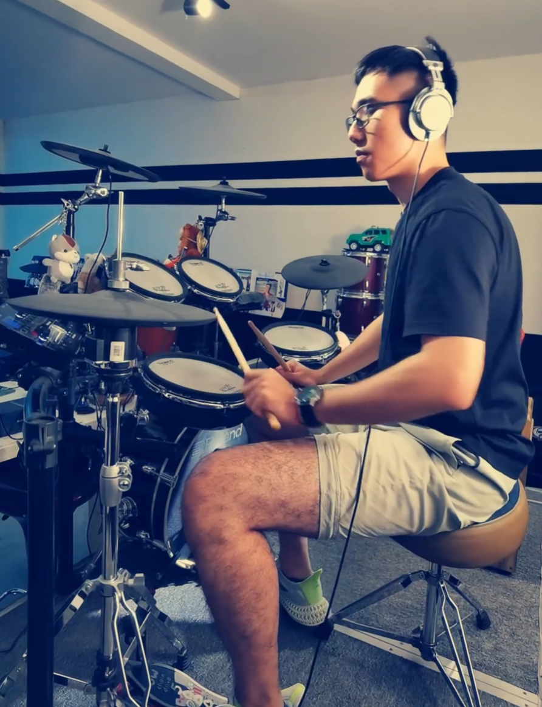

## My Hobbies

### 1. Fitness Training
I really enjoy doing strength training at the gym. It not only keeps me energetic enough to cope with pressure but also tempers my willpower.

### 2. Play the drum
Playing the drum kit is my way of relieving stress and finding a sense of rhythm. I truly enjoy the feeling of being immersed in music. Although I am still constantly practicing, the sense of accomplishment after playing an entire piece is irreplaceable.

### 3.Travel and Urban Food Exploration
I love traveling to different cities and exploring their most distinctive local delicacies.

[Food I explore in Boston](food_pic.png)